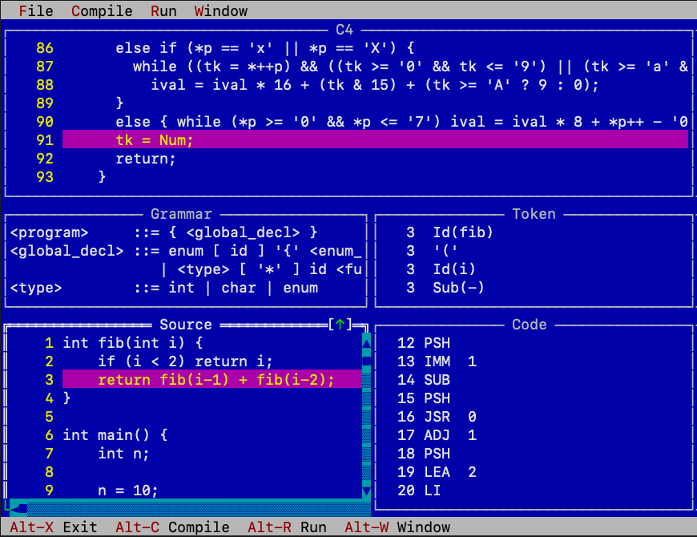

# visic4 

An interactive, visual [C4](https://github.com/rswier/c4) compiler/interpreter IDE inspired by
[VisiCLANG](https://dl.acm.org/doi/10.1145/87416.87483).

The goal is to make the compilation and execution of C programs **visible**:
we can watch the compiler tokenize, parse, and generate code instruction
by instruction, then switch to runtime mode and single-step through the
generated virtual machine, observing the stack, variables, and output in real
time.

<a href="visic4.png"></a>

## Features

### Compile Mode

In compile mode, the screen is divided into five synchronized windows:

| Window | Description |
|--------|-------------|
| **C4** | The full C4 compiler source with line numbers. As compilation proceeds, the currently executing line of the compiler is highlighted, showing *which part of the compiler* is handling each token. |
| **Grammar** | BNF grammar rules for the C4 subset. The active production rule is highlighted as each token is parsed. |
| **Token** | Displays the current token being processed by the compiler. |
| **Source** | The input C source file being compiled, with the current line highlighted. |
| **Code** | Generated virtual machine instructions, revealed incrementally as compilation progresses. |

Compilation can be controlled with:
- **Compile** (Ctrl-P) -- start/restart compilation
- **Step Over** (Ctrl-S) -- advance one step
- **Cycle** (Ctrl-Y) -- advance one token (all C4 lines for that token)
- **Continue** (Ctrl-N) -- run until the next breakpoint
- **Stop** (Ctrl-B) -- pause compilation
- **Speed** -- adjust auto-step delay (milliseconds)
- **Breakpoints** -- click a line number in the C4 window to toggle; Ctrl-K to clear all

### Runtime Mode

After compilation, switch to runtime mode (Ctrl-W) to execute the generated
bytecode on the C4 virtual machine:

| Window | Description |
|--------|-------------|
| **C4** | The compiler source, now highlighting the VM instruction dispatch loop. |
| **Code** | The generated bytecode with the current program counter highlighted. |
| **Source** | The original C source, with the corresponding source line highlighted. |
| **Stack** | The VM stack contents, with SP and BP markers. |
| **Variable** | Local variables and parameters of the current stack frame. |
| **Input/Output** | Program output from `printf` and `exit`. |

Runtime controls:
- **Run** (Ctrl-R) -- start/continue execution
- **Step Over** (Ctrl-S) -- execute one VM instruction
- **Cycle** (Ctrl-Y) -- execute one instruction automatically
- **Continue** (Ctrl-N) -- run until the next breakpoint
- **Stop** (Ctrl-B) -- pause execution
- **Restart** (Ctrl-T) -- re-initialize the VM

### Other Features

- **Load Source** (Ctrl-O) -- load a C source file via file dialog
- **Window management** -- switch between Default Layout, Cascade, or select individual windows from the Window menu
- Built-in example source (`fib.c`) loaded by default
- Breakpoint support on the C4 compiler source (compile mode) and generated code (runtime mode)

## Building

### Prerequisites

- C++17 compiler (e.g., `g++` or `clang++`)
- [Turbo Vision](https://github.com/magiblot/tvision) library (included as `lib/libtvision.a` and headers in `include/`)
- ncurses

### Compile

```
make
```

### Run

```
./visic4
```

To compile a different source file, use **File > Load Source** (Ctrl-O) or
place `.c` files in the `examples/` directory.